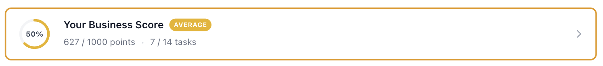

# Laravel Model Scores



Laravel modelləri üçün çevik xallandırma sistemi. İstənilən Eloquent modelinə xal, cərimə və nişan əlavə edin — quraşdırma tələb olunmur. Hazır olduqda kalkulyatorlar, tapşırıq qrupları, xal azalması, event sourcing və daha çoxu ilə dərinləşin.

**[English (EN)](README.md)** | **[Turkish (TR)](README.tr.md)**

## Niyə Bu Paket?

Əksər Laravel tətbiqləri müəyyən bir məqamda nəyisə xallamaq, sıralamaq və ya qiymətləndirmək məcburiyyətində qalır — satıcının etibarlılığı, istifadəçinin profil tamlığı, elanın keyfiyyəti. Bir neçə `if` ifadəsi ilə başlayırsınız, sonra çəkilər əlavə edirsiniz, sonra tarixçə izləmə lazım olur, sonra kimsə nişan istəyir. Qısa müddətdə xallandırma məntiqi kod bazanıza dağılmış, audit izi olmayan və qeyri-ardıcıl vəziyyətə gəlir.

Laravel Model Scores bunu strukturlu şəkildə həll edir. Hər xallandırma meyarını izolə edilmiş kalkulyator sinfi olaraq təyin edin, məntiqi qruplara ayırın, çəkilər təyin edin və qalanını paketə buraxın — nişan keçidləri, event sourcing, xal azalması və toplu yenidən hesablama daxil.

**Ümumi istifadə sahələri:**

- **Bazar keyfiyyət xalları** — Satıcıları profil tamlığı, cavab nisbətləri, rəylər və icra metriklərinə görə xallandırın. Airbnb Superhost və ya Etsy Star Seller məntiqi.
- **Profil tamamlama** — İstifadəçiləri checklist və irəliləmə çubuğu ilə profillərini tamamlamağa yönləndirin. Hər boş sahə bir xallandırma tapşırığıdır.
- **Oyunlaşdırma və sadiqlik səviyyələri** — Əlaqə, satınalma və ya məzmun istehsalına xal verin. Xal aralıqlarına görə Bürünc/Gümüş/Qızıl nişanları avtomatik təyin edin.
- **Uyğunluq xallandırma** — Təşkilatları təhlükəsizlik auditləri, normativ uyğunluq və ya proses tamamlama vəziyyətinə görə xallandırın. Decay xüsusiyyəti köhnəlmiş uyğunluğu zamanla azaldır.
- **Məzmun və elan keyfiyyəti** — Məhsulları və ya məqalələri verilənlər tamlığı, şəkil sayı və təsvir keyfiyyətinə görə xallandırın. Xalları axtarış sıralamasında istifadə edin.

**Nə zaman istifadə etməlisiniz:**

- Birdən çox müstəqil xallandırma meyarınız var
- Meyarlar fərqli məntiq istifadə edir (boolean yoxlama, mütənasib metrik, əks nisbət, pilləli hədd)
- Xal dəyişikliklərinin audit izinə ehtiyacınız var
- Nişanların və ya səviyyələrin avtomatik yenilənməsini istəyirsiniz
- Bəzi metriklərin yenilənməzsə zamanla azalması lazımdır

**Nə zaman ehtimal ki lazım deyil:**

- Tək bir tam ədəd sayğacı kifayətdir (sadəcə bir kolon istifadə edin)
- Yalnız istifadəçilərin verdiyi ulduz xallarına ehtiyacınız var (bir rəy paketi istifadə edin)
- "Xalınız" tarixçə tələb etməyən tək bir hesablanmış dəyərdir

## Tələblər

- PHP 8.2+
- Laravel 11 və ya 12

## Quraşdırma

```bash
composer require aftandilmmd/laravel-model-scores
```

Konfiqurasiya və migration-ları dərc edin:

```bash
php artisan vendor:publish --tag=model-scores-config
php artisan vendor:publish --tag=model-scores-migrations
php artisan migrate
```

## Sürətli Başlanğıc

### 1. Trait Əlavə Edin

```php
use Aftandilmmd\LaravelModelScores\Traits\HasModelScores;

class Tenant extends Model
{
    use HasModelScores;
}
```

### 2. Xal Əlavə Edin və Çıxarın

```php
// Bonus xal əlavə edin (opsional son istifadə tarixi ilə)
$tenant->addScoreBonus(20, 'Xoş gəldin bonusu', now()->addDays(30));

// Cərimə xalı əlavə edin
$tenant->addScorePenalty(10, 'Gecikmiş ödəniş');

// Toplam xalı oxuyun
$total = ModelScore::getTotalScore($tenant);
```

### 3. Cari Nişanı Alın

```php
$badge = $tenant->scoreBadge();
// $badge->name, $badge->color, $badge->icon
```

### 4. Xal Tarixçəsini Görüntüləyin

```php
$history = $tenant->scoreHistory(days: 30);
// [{ date, total, previous_total, change }, ...]
```

Əsas istifadə budur — bonus/cərimə, nişanlar, tarixçə. Kalkulyator və ya tapşırıq təyin etməyə ehtiyac yoxdur.

### Facade İstifadəsi

`ModelScore` facade-ı eyni imkanları artı toplu əməliyyatları təqdim edir:

```php
use Aftandilmmd\LaravelModelScores\Facades\ModelScore;

// Facade ilə düzəliş əlavə et
ModelScore::addAdjustment($tenant, 20, 'bonus', 'Xoş gəldin bonusu', now()->addDays(30));

// Düzəlişi ləğv et
ModelScore::revokeAdjustment($adjustment);

// Düzəlişləri sorğula
$active = ModelScore::getActiveAdjustments($tenant);
$total = ModelScore::getAdjustmentsTotal($tenant);

// Bütün mövcud nişanları al
$badges = ModelScore::getAvailableBadges();
```

### Xalı Modeldə Keşləmə (Opsional)

Varsayılan olaraq toplam xal hər oxumada verilənlər bazasından hesablanır. Daha sürətli əlçatanlıq üçün modelinizin cədvəlində keşləyə bilərsiniz:

1. Migration-ınıza kolon əlavə edin:

```php
$table->unsignedInteger('model_score')->default(0);
```

2. Config-də göstərin:

```php
// config/model-scores.php
'score_column' => 'model_score',
```

İndi `$tenant->model_score` hər zaman mövcuddur və avtomatik yenilənir.

---

## Gelişmiş İstifadə

Aşağıdakıların hamısı opsionaldır — ehtiyacınız olanı istifadə edin.

### Kalkulyator Sistemi

Manuel bonus/cərimə əvəzinə, modellərinizi avtomatik qiymətləndirən **kalkulyatorlu xallandırma tapşırıqları** təyin edin.

#### Kalkulyator Yaradın

Hər xallandırma meyarının öz kalkulyator sinfi var:

```php
use Aftandilmmd\LaravelModelScores\Calculators\BaseCalculator;
use Illuminate\Database\Eloquent\Model;

class ProfilePhotoCalculator extends BaseCalculator
{
    public function calculate(Model $scoreable, int $maxPoints, array $taskMetadata = []): array
    {
        return $this->binaryScore(
            ! empty($scoreable->profile_photo),
            $maxPoints
        );
    }
}
```

#### Tapşırıqları Qeydə Alın

Xallandırılan meyarları seeder və ya migration ilə təyin edin:

```php
use Aftandilmmd\LaravelModelScores\Models\ModelScoreTask;

ModelScoreTask::create([
    'key' => 'profile_photo',
    'name' => 'Profil Şəkli Yüklə',
    'calculator' => ProfilePhotoCalculator::class,
    'type' => 'static',
    'max_points' => 50,
]);
```

#### Xalları Hesablayın

```php
// Bir model üçün bütün tapşırıqları hesabla
$tenant->calculateScore();

// Yalnız statik və ya dövri tapşırıqlar
$tenant->calculateScore('static');

// Bütün modellər üçün hesabla (100-lük qruplar halında)
ModelScore::calculateForAll(Tenant::class);

// Xüsusi sorğu ilə
ModelScore::calculateForAll(Tenant::class, query: Tenant::where('is_active', true));
```

#### Nəticələri Sorğulayın

```php
// Tapşırıq bazlı ətraflı döküm
$breakdown = $tenant->scoreBreakdown();

// Checklist elementləri (sehrbaz interfeysi üçün)
$checklist = $tenant->scoreChecklist();
```

### Kalkulyator Referansı

`BaseCalculator` ümumi xallandırma nümunələri üçün dörd köməkçi metod təqdim edir. Hər köməkçi eyni strukturu qaytarır:

```php
['score' => int, 'metadata' => array]
```

İstənilən köməkçiyə xüsusi `$metadata` da ötürə bilərsiniz — xal ilə birlikdə debug və ya göstərmə məqsədilə saxlanılır.

---

#### `binaryScore` — Ya Hamısı Ya Heç Nə

Şərt ödənildikdə tam xal, əks halda sıfır verir. "Profil şəkli var mı" və ya "e-poçt təsdiqlənib mi" kimi bəli/xeyr yoxlamaları üçün istifadə edin.

```php
$this->binaryScore(bool $condition, int $maxPoints, array $metadata = []): array
```

| Parametr | Tip | Təsvir |
| -------- | --- | ------ |
| `$condition` | `bool` | Qiymətləndiriləcək yoxlama |
| `$maxPoints` | `int` | `true` olduqda verilən xal |

**Formul:** `$condition ? $maxPoints : 0`

**Nümunə — Host kimlik təsdiqi (Airbnb Superhost):**

```php
class HostIdentityVerifiedCalculator extends BaseCalculator
{
    public function calculate(Model $scoreable, int $maxPoints, array $taskMetadata = []): array
    {
        return $this->binaryScore(
            ! empty($scoreable->identity_verified_at),
            $maxPoints,
            ['verified' => ! empty($scoreable->identity_verified_at)]
        );
    }
}
```

| Ssenari | maxPoints | Nəticə |
| ------- | --------- | ------ |
| Təsdiqlənib | 50 | `['score' => 50, 'metadata' => ['verified' => true]]` |
| Təsdiqlənməyib | 50 | `['score' => 0, 'metadata' => ['verified' => false]]` |

---

#### `proportionalScore` — Xətti Nisbət

0.0 ilə 1.0 arasındakı nisbətə görə xal verir. Nisbət avtomatik məhdudlaşdırılır — 0-dan aşağı 0, 1-dən yuxarı 1 olur. Hədəfə qədər "çox olan daha yaxşı" halları üçün istifadə edin.

```php
$this->proportionalScore(float $ratio, int $maxPoints, array $metadata = []): array
```

| Parametr | Tip | Təsvir |
| -------- | --- | ------ |
| `$ratio` | `float` | 0.0–1.0 arası dəyər (avtomatik məhdudlaşdırılır) |
| `$maxPoints` | `int` | Əldə edilə biləcək maksimum xal |

**Formul:** `round(clamp($ratio, 0, 1) * $maxPoints)`

**Nümunə — Host cavab nisbəti (Airbnb Superhost üçün %90+ tələb olunur):**

```php
class ResponseRateCalculator extends BaseCalculator
{
    public function calculate(Model $scoreable, int $maxPoints, array $taskMetadata = []): array
    {
        $total = $scoreable->inquiries()->where('created_at', '>=', now()->subYear())->count();
        $responded = $scoreable->inquiries()->where('created_at', '>=', now()->subYear())
            ->whereNotNull('responded_at')->count();

        $rate = $total > 0 ? $responded / $total : 1.0;

        return $this->proportionalScore($rate, $maxPoints, [
            'total_inquiries' => $total,
            'responded' => $responded,
            'response_rate' => round($rate * 100, 1),
        ]);
    }
}
```

| Cavab Nisbəti | Nisbət | maxPoints | Xal |
| ------------- | ------ | --------- | --- |
| %100 | 1.0 | 100 | 100 |
| %90 | 0.9 | 100 | 90 |
| %50 | 0.5 | 100 | 50 |
| %0 | 0.0 | 100 | 0 |

---

#### `inverseScore` — Aşağı Olan Daha Yaxşı

Nisbət aşağı olduqda yüksək xal verir. Xal, nisbətin 0 olduğu nöqtədə `$maxPoints`-dən, nisbətin həddə çatdığı nöqtədə 0-a doğru xətti azalır. Ləğv nisbəti və ya şikayət nisbəti kimi azın daha yaxşı olduğu metriklər üçün istifadə edin.

```php
$this->inverseScore(float $ratio, float $threshold, int $maxPoints, array $metadata = []): array
```

| Parametr | Tip | Təsvir |
| -------- | --- | ------ |
| `$ratio` | `float` | Cari nisbət (məs. %15 üçün 0.15) |
| `$threshold` | `float` | Xalın sıfır olacağı nisbət (məs. %20 üçün 0.20) |
| `$maxPoints` | `int` | Nisbət 0 olduqda verilən xal |

**Formul:** `ratio >= threshold ? 0 : round((1 - ratio / threshold) * maxPoints)`

**Nümunə — Host ləğv nisbəti (Airbnb Superhost üçün <%1 tələb olunur):**

```php
class CancellationRateCalculator extends BaseCalculator
{
    public function calculate(Model $scoreable, int $maxPoints, array $taskMetadata = []): array
    {
        $total = $scoreable->reservations()->where('check_in', '>=', now()->subYear())->count();
        $cancelled = $scoreable->reservations()->where('check_in', '>=', now()->subYear())
            ->where('cancelled_by', 'host')->count();

        $rate = $total > 0 ? $cancelled / $total : 0;

        return $this->inverseScore($rate, 0.05, $maxPoints, [
            'total_reservations' => $total,
            'cancelled_by_host' => $cancelled,
            'cancellation_rate' => round($rate * 100, 2),
        ]);
    }
}
```

| Ləğv Nisbəti | Hədd | maxPoints | Xal |
| ------------ | ---- | --------- | --- |
| %0 (0.00) | 0.05 | 100 | 100 |
| %1 (0.01) | 0.05 | 100 | 80 |
| %2.5 (0.025) | 0.05 | 100 | 50 |
| %4 (0.04) | 0.05 | 100 | 20 |
| %5+ (0.05) | 0.05 | 100 | 0 |

---

#### `tieredScore` — Pilləli Hədlər

Dəyərin hansı pilləyə düşdüyünə görə xal verir. Hər pillə minimum dəyəri nisbətə (0.0–1.0) eşləyir və uyğun gələn ən yüksək pillənin nisbəti `proportionalScore` ilə istifadə olunur. "Ən azı 5 şəkil yüklə = %50" kimi addım əsaslı xallandırma üçün istifadə edin.

```php
$this->tieredScore(float $value, array $tiers, int $maxPoints, array $metadata = []): array
```

| Parametr | Tip | Təsvir |
| -------- | --- | ------ |
| `$value` | `float` | Ölçülən dəyər (məs. şəkil sayısı) |
| `$tiers` | `array` | `[hədd => nisbət]` cütləri, məs. `[0 => 0.0, 5 => 0.5, 10 => 1.0]` |
| `$maxPoints` | `int` | Əldə edilə biləcək maksimum xal |

**Formul:** `$value >= threshold` olan ən yüksək pilləni tap, nisbətini al, sonra `round(nisbət * maxPoints)`.

**Nümunə — Elan fotoşəkilləri (Airbnb 20+ şəkil tövsiyə edir):**

```php
class ListingPhotosCalculator extends BaseCalculator
{
    public function calculate(Model $scoreable, int $maxPoints, array $taskMetadata = []): array
    {
        return $this->tieredScore($scoreable->photos()->count(), [
            0  => 0.0,   // Şəkil yoxdur
            1  => 0.15,  // Ən azı bir — elan görünür
            5  => 0.35,  // Əsas sahə əhatəsi
            10 => 0.60,  // Yaxşı — hər otaq göstərilib
            15 => 0.80,  // Ətraflı — imkanlar və ətraf
            20 => 1.0,   // Peşəkar səviyyə elan
        ], $maxPoints);
    }
}
```

| Şəkil | Uyğun Pillə | Nisbət | maxPoints | Xal |
| ----- | ----------- | ------ | --------- | --- |
| 0 | `0 => 0.0` | 0.0 | 80 | 0 |
| 3 | `1 => 0.15` | 0.15 | 80 | 12 |
| 7 | `5 => 0.35` | 0.35 | 80 | 28 |
| 12 | `10 => 0.60` | 0.60 | 80 | 48 |
| 25 | `20 => 1.0` | 1.0 | 80 | 80 |

---

#### Doğru Kalkulyator Tipini Seçmə

| Tip | Ən Yaxşı İstifadə | Nümunə |
| --- | ------------------ | ------ |
| **Binary** | Bəli/xeyr şərtləri | Kimlik təsdiqlənib, e-poçt onaylanıb, profil şəkli yüklənib |
| **Proportional** | Hədəfli "çox olan daha yaxşı" metriklər | Cavab nisbəti (hədəf %100), rəy xalı (hədəf 4.8) |
| **Inverse** | Kəsim nöqtəli "az olan daha yaxşı" metriklər | Host ləğv nisbəti, şikayət nisbəti, geri ödəmə nisbəti |
| **Tiered** | Addım əsaslı nailiyyətlər | Elan fotoşəkilləri, imkan sayısı, tamamlanmış qonaqlamalar |

#### Köməkçiləri Birləşdirmə

Tək bir kalkulyator daxilində doğru köməkçini seçmək üçün məntiq istifadə edə bilərsiniz:

```php
class ListingDescriptionCalculator extends BaseCalculator
{
    public function calculate(Model $scoreable, int $maxPoints, array $taskMetadata = []): array
    {
        $description = $scoreable->description ?? '';
        $length = mb_strlen(strip_tags($description));

        // Təsvir yoxdur = binary uğursuz
        if ($length === 0) {
            return $this->binaryScore(false, $maxPoints);
        }

        // Təsvir keyfiyyət pillələrinə görə xallandır
        return $this->tieredScore($length, [
            1   => 0.20,  // Nəsə var — heç nədən yaxşıdır
            50  => 0.40,  // Qısa — əsasları əhatə edir
            150 => 0.70,  // Ətraflı — imkanlar və qaydalar qeyd olunub
            400 => 1.0,   // Hərtərəfli — məhəllə, məsləhətlər və s.
        ], $maxPoints);
    }
}
```

#### Metadata İstifadəsi

Bütün köməkçilər opsional `$metadata` massivi qəbul edir. Debug məlumatları, ara dəyərlər və ya göstərmə verilənlərini saxlamaq üçün istifadə edin:

```php
return $this->proportionalScore($rate, $maxPoints, [
    'total_inquiries' => $total,
    'responded' => $responded,
    'response_rate' => 85.0,
]);
// Qaytarır: ['score' => 85, 'metadata' => ['total_inquiries' => 20, 'responded' => 17, 'response_rate' => 85.0]]
```

Metadata `model_scores_scores` cədvəlində saxlanılır və `$host->scoreBreakdown()` vasitəsilə əlçatandır.

---

### Tapşırıq Qrupları

Tapşırıqları məntiqi qruplara ayırın:

```php
use Aftandilmmd\LaravelModelScores\Models\ModelScoreTaskGroup;

$group = ModelScoreTaskGroup::create([
    'key' => 'profile',
    'name' => 'Profil Tamamlama',
    'icon' => 'user',
    'order_column' => 1,
]);

ModelScoreTask::create([
    'key' => 'profile_photo',
    'name' => 'Profil Şəkli Yüklə',
    'group_id' => $group->id,
    'calculator' => ProfilePhotoCalculator::class,
    'type' => 'static',
    'max_points' => 50,
]);
```

---

### Çəkili Xallandırma

Tapşırıqlara fərqli çəkilər verin:

```php
'features' => ['weights' => true],
```

```php
ModelScoreTask::create([
    'key' => 'reviews',
    'name' => 'Müştəri Rəyləri',
    'calculator' => ReviewsCalculator::class,
    'type' => 'periodic',
    'max_points' => 100,
    'weight' => 1.50, // 1.5x çarpan → ən çox 150 xal
]);
```

---

### Xal Azalması (Decay)

Dövri tapşırıq xalları yenidən hesablanmazsa zamanla azalır:

```php
'features' => ['decay' => true],
'decay' => ['strategy' => 'linear'], // və ya 'exponential'
```

```php
ModelScoreTask::create([
    'key' => 'returning_customers',
    'calculator' => ReturningCustomersCalculator::class,
    'type' => 'periodic',
    'max_points' => 100,
    'decay_days' => 30, // 30 gün sonra azalmağa başlayır
]);
```

- **Linear**: Azalma müddətindən sonra gündə %2 azalır
- **Exponential**: Azalma müddətindən sonra hər gün 0.95 ilə vurulur

---

### Nişan Sistemi

Xal aralıqlarına görə avtomatik atanan nişanlar:

```php
use Aftandilmmd\LaravelModelScores\Models\ModelScoreBadge;

ModelScoreBadge::create(['key' => 'bronze', 'name' => 'Bürünc', 'min_score' => 100, 'max_score' => 299, 'color' => '#CD7F32']);
ModelScoreBadge::create(['key' => 'silver', 'name' => 'Gümüş', 'min_score' => 300, 'max_score' => 599, 'color' => '#C0C0C0']);
ModelScoreBadge::create(['key' => 'gold',   'name' => 'Qızıl', 'min_score' => 600, 'max_score' => null, 'color' => '#FFD700']);
```

Xal hesablaması zamanı nişan dəyişdikdə `BadgeEarned` və `BadgeLost` event-ləri avtomatik tetiklənir.

---

### Xal Profilləri

Bir modeli birdən çox ölçüdə müstəqil olaraq xallandırın:

```php
ModelScoreTask::create([
    'key' => 'profile_photo',
    'calculator' => ProfilePhotoCalculator::class,
    'max_points' => 50,
    'type' => 'static',
    'profile' => 'quality',
]);

$tenant->calculateScore(profile: 'quality');
$badge = $tenant->scoreBadge(profile: 'quality');
```

---

### Event Sourcing və Tarixçə

Hər xal dəyişikliyi event qeydi olaraq saxlanılır:

```php
'features' => ['event_log' => true],
```

```php
// Günlük toplamlar (qrafiklər üçün)
$history = ModelScore::getScoreHistory($tenant, days: 30);

// Tam event zaman xətti
$timeline = ModelScore::getScoreTimeline($tenant, limit: 50);

// Event tipinə görə filtr
$timeline = ModelScore::getScoreTimeline($tenant, eventType: 'badge_earned');
```

Event tipləri: `task_score_changed`, `adjustment_added`, `adjustment_expired`, `adjustment_revoked`, `badge_earned`, `badge_lost`, `recalculated`

---

### Hədd Bildirişləri

Xallar konfiqurasiya edilmiş hədləri keçdikdə event tetikləyin:

```php
'thresholds' => [
    'score_rose_above' => [500, 750, 900],
    'score_dropped_below' => [200, 100],
],
```

```php
Event::listen(ScoreThresholdCrossed::class, function ($event) {
    // $event->scoreable, $event->threshold, $event->direction ('up' və ya 'down')
});
```

---

## Event-lər

| Event | Nə Zaman |
| ----- | -------- |
| `ScoresCalculated` | Bir model üçün bütün tapşırıqlar hesablandıqdan sonra |
| `TaskScoreUpdated` | Tək bir tapşırıq xalı dəyişdikdə |
| `BadgeEarned` | Xal yeni bir nişan səviyyəsinə çatdıqda |
| `BadgeLost` | Xal nişan səviyyəsinin altına düşdükdə |
| `ScoreThresholdCrossed` | Konfiqurasiya edilmiş hədd keçildikdə |
| `ManualAdjustmentApplied` | Əl ilə düzəliş əlavə edildikdə |

---

## Artisan Əmrləri

```bash
# Bütün modellər üçün xalları hesabla
php artisan model-scores:calculate "App\Models\Tenant"

# Müəyyən bir model üçün hesabla
php artisan model-scores:calculate "App\Models\Tenant" --id=1

# Yalnız statik və ya dövri tapşırıqlar
php artisan model-scores:calculate "App\Models\Tenant" --type=static

# Müəyyən bir profil istifadə et
php artisan model-scores:calculate "App\Models\Tenant" --profile=quality

# Köhnə event qeydlərini təmizlə
php artisan model-scores:prune-events --days=365
```

---

## Livewire Komponentləri (Opsional)

Config-dən `model-scores.livewire.enabled = true` ilə aktivləşdirin:

```blade
<livewire:model-scores-checklist :scoreable="$tenant" />
<livewire:model-scores-progress-bar :scoreable="$tenant" />
<livewire:model-scores-breakdown-chart :scoreable="$tenant" />
```


---

## REST API (Opsional)

Config-dən `model-scores.api.enabled = true` ilə aktivləşdirin:

| Metod | Endpoint | Təsvir |
| ----- | -------- | ------ |
| GET | `/api/model-scores/tasks` | Tapşırıq siyahısı |
| GET | `/api/model-scores/{type}/{id}/breakdown` | Xal dökümü |
| GET | `/api/model-scores/{type}/{id}/history` | Xal tarixçəsi |
| POST | `/api/model-scores/{type}/{id}/adjustments` | Düzəliş əlavə et |
| DELETE | `/api/model-scores/adjustments/{id}` | Düzəlişi ləğv et |

---

## Konfiqurasiya Referansı

Bütün xüsusiyyətlər `config/model-scores.php`-dən açılıb bağlana bilər:

```php
'features' => [
    'badges' => true,
    'event_log' => true,
    'decay' => true,
    'adjustments' => true,
    'weights' => true,
    'groups' => true,
    'thresholds' => true,
],
```

| Açar | Varsayılan | Təsvir |
| ---- | ---------- | ------ |
| `score_column` | `null` | Modeldə toplam xalı keşləyən kolon. `null` = DB-dən hesabla |
| `decay.strategy` | `'linear'` | `'linear'` və ya `'exponential'` |
| `event_log.retention_days` | `365` | Event qeydlərini saxlama müddəti (gün) |
| `api.enabled` | `false` | REST API endpoint-lərini aktivləşdir |
| `livewire.enabled` | `true` | Livewire komponentlərini qeydə al |

---

## Verilənlər Bazası Cədvəlləri

Paket 6 cədvəl yaradır (hamısı config vasitəsilə fərdiləşdirilə bilər):

| Cədvəl | Məqsəd |
| ------ | ------ |
| `model_scores_task_groups` | Tapşırıq qrupu tərifləri |
| `model_scores_tasks` | Kalkulyator FQCN-li tapşırıq tərifləri |
| `model_scores_scores` | Model başına tapşırıq xal nəticələri |
| `model_scores_score_events` | Event səviyyəsində xal tarixçəsi |
| `model_scores_badges` | Nişan/səviyyə tərifləri |
| `model_scores_adjustments` | Əl ilə xal düzəlişləri |

## Lisenziya

MIT Lisenziyası. Ətraflı məlumat üçün [LICENSE](LICENSE) faylına baxın.
